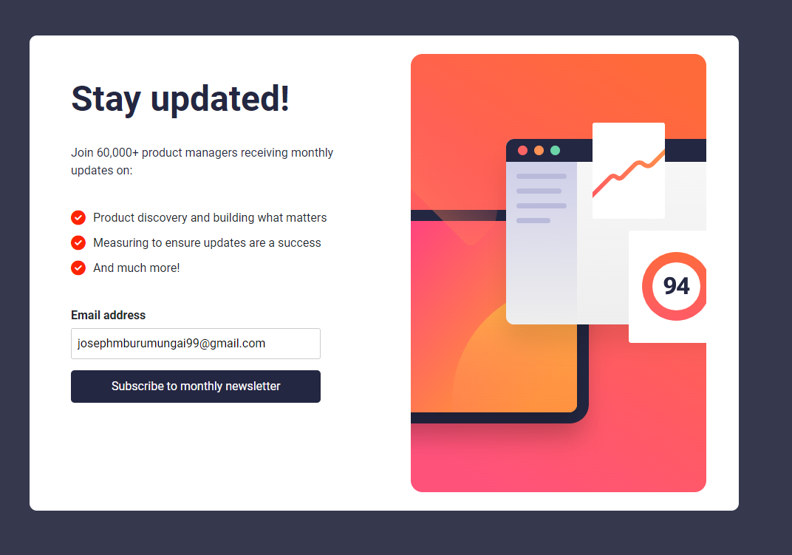

# Newsletter Sign-up Form with Success Message

This project is a solution to the [Newsletter sign-up form with success message challenge](https://www.frontendmentor.io/challenges/newsletter-signup-form-with-success-message-3FC1AZbNrv) on Frontend Mentor. The challenge aims to improve my coding skills by building realistic projects.

## Table of Contents

- [Overview](#overview)
- [The Challenge](#the-challenge)
- [Screenshots](#screenshots)
- [Links](#links)
- [Built With](#built-with)
- [What I Learned](#what-i-learned)
- [Continued Development](#continued-development)
- [Author](#author)

## Overview

### The Challenge

The challenge required implementing a newsletter sign-up form with a success message. Key user interactions and display aspects included:

- Adding an email and submitting the form.
- Displaying a success message with the submitted email.
- Showing form validation messages for empty fields and incorrect email formats.
- Ensuring optimal layout based on different device screen sizes.
- Implementing hover and focus states for interactive elements.

### Screenshots


<!-- Replace the screenshot path with the actual screenshot of your solution. -->

### Links

- [Solution URL](https://your-solution-url.com)
- [Live Site URL](https://your-live-site-url.com)

## Built With

- Semantic HTML5 markup
- CSS custom properties
- Flexbox
- CSS Grid
- Responsive design principles
- Vanilla JavaScript

## What I Learned

While working on this project, I gained insights into:

- Implementing a responsive design that adapts to different screen sizes.
- Using CSS Grid and Flexbox for layout structuring.
- Validating form input using JavaScript and displaying appropriate messages.
- Enhancing user experience with hover and focus states.
- Creating a simple, clean UI for form interaction and success messaging.

Here's an example of validating email format in JavaScript:

```js
function validateEmail(email) {
    const emailPattern = /^[^\s@]+@[^\s@]+\.[^\s@]+$/;
    return emailPattern.test(email);
}
```

### Continued Development

In future projects, I plan to focus on:

- Improving accessibility and ensuring the site is usable for everyone.
- Exploring more advanced CSS techniques and animations.
- Integrating backend functionality for real form submissions.
- Learning more about JavaScript frameworks to streamline development.

### Author

Joseph Mburu Mungai
Frontend Mentor - @Josephmungai99
Twitter - @joseph_mungai_
